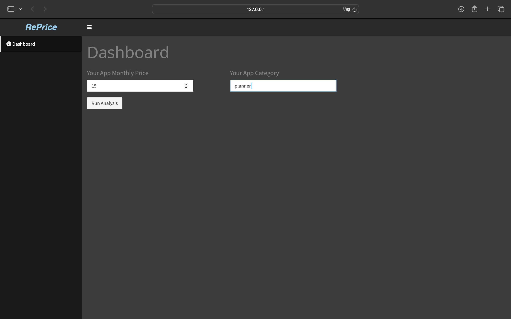
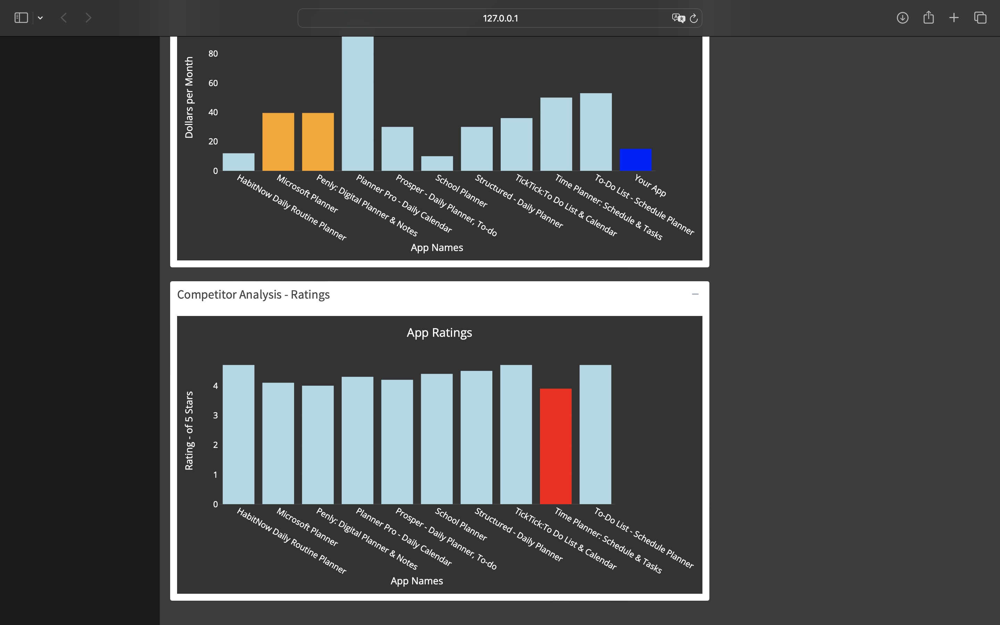

    
    

    
    

reprice allows users to input their app category and their current monthly pricing. The app then returns the top 10 app competitors within the inputted category, along with the monthly pricing and ratings for each. The findings are displayed in a simple dashboard, comparing the user's app information with the found competitors.

Features

Competitor Analysis: Get a list of the top 10 competitors in your app category.
Pricing Comparison: View competitor pricing alongside your own for easy comparison.
Ratings Comparison: View competitor ratings.
Dashboard Visualization: A user-friendly dashboard to display all the data clearly.

Requirements

OpenAI API Key: RePrice requires a working OpenAI API key for pricing estimation.
PostgreSQL Database: A connection to a PostgreSQL database is needed for the storage of app data findings.

NOTES

webscrapeNOAI.py is the default file used for webscraping data.
In order to use the AI pricing estimation algorithm, within server.r, change this line:
'py_run_string(paste("import sys; sys.argv = ['webscrapeNOAI.py', '", input$text_input, "']; exec(open('/Users/alexplash/reprice/webscrapeNOAI.py').read())"))'
to this line:
'py_run_string(paste("import sys; sys.argv = ['webscrape.py', '", input$text_input, "']; exec(open('/Users/alexplash/reprice/webscrape.py').read())"))'

